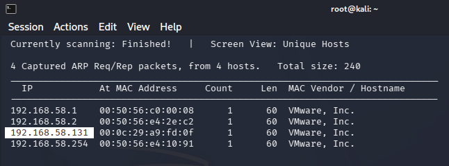
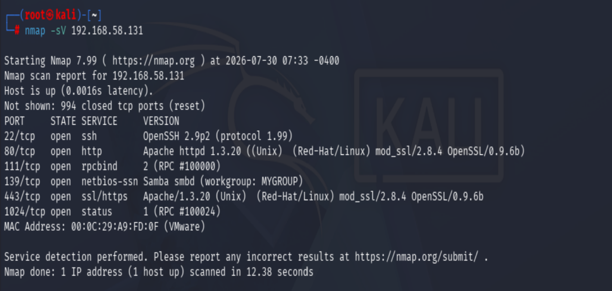
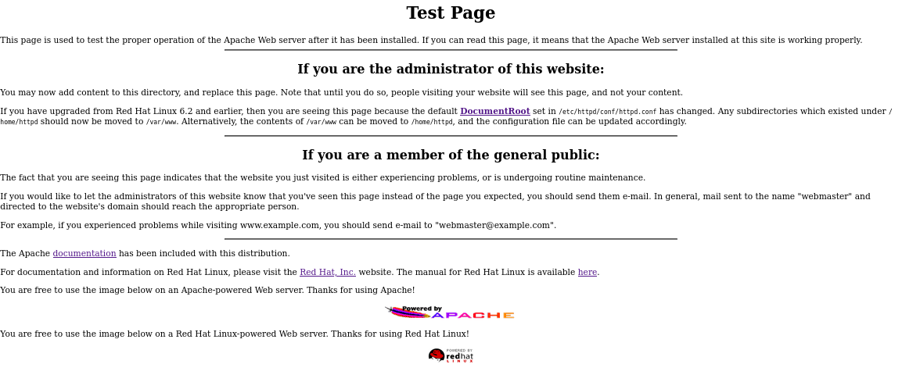
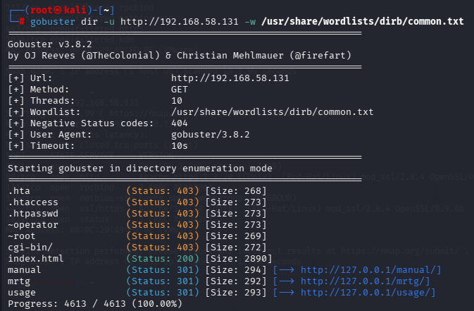
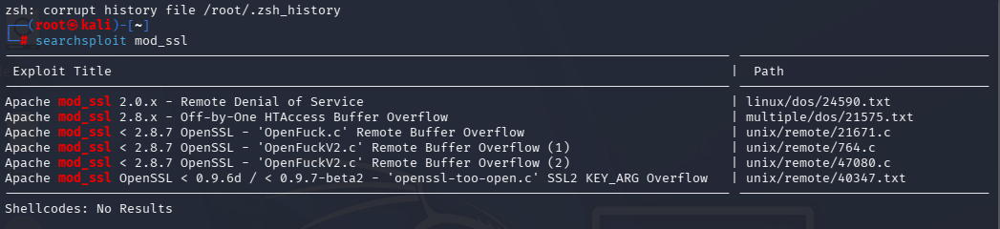
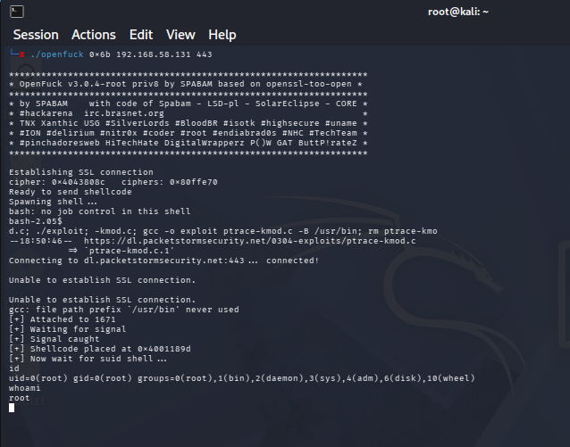

# KIOPTRIX Level 1

## Machine Information

- **Platform:** VulnHub
- **Difficulty:** Beginner
- **Status:** Completed
- **Date:** 2026-07-27

## Goal

Gain root access to the target machine.

---

# Reconnaissance

The first objective was to identify the target machine and determine the exposed network services.

## Host Discovery

### Goal

Identify the target's IP address on the local network.

### Method

```bash
netdiscover -r 192.168.58.1/24
```

### Findings



Target IP : `192.168.58.131`
### Conclusion

The target machine was successfully identified, allowing further enumeration.

---

## Port & Service Discovery

### Goal

Identify open ports and determine the services running on them.

### Method

```bash
nmap -sV 192.168.58.131
```

### Findings



### Conclusion

Several outdated services were exposed. Their versions would be used during the vulnerability assessment phase.

---

# Enumeration

## Enumeration Plan

| Service | Enumeration Goal |
|----------|------------------|
| SSH | Record version and determine whether credentials are required. |
| HTTP | Inspect the website and search for hidden content. |
| SMB | Look for anonymous shares, usernames, and version information. |
| RPC | Identify exposed RPC services. |
| HTTPS | Compare its behavior with HTTP. |

---

## HTTP Enumeration

### Goal

Determine whether the web server exposes an application or useful information.

### Method

Visited the website in a browser.

```
http://192.168.58.131
```

### Findings



### Conclusion

The homepage did not expose an attack surface, so I continued with web content enumeration.

---

## Web Content Enumeration

### Goal

Discover hidden files and directories.

### Method

```bash
gobuster dir -u http://192.168.58.131 -w /usr/share/wordlists/dirb/common.txt
```

### Findings



### Conclusion

No hidden web application or sensitive content was discovered. I shifted my focus to the remaining services.

---

## SMB Enumeration

### Goal

Determine whether SMB exposes shares, usernames, or other useful information.

### Method

```bash
smbclient -L //192.168.58.131 -N

smbmap -H 192.168.58.131

enum4linux 192.168.58.131

nmap --script smb* 192.168.58.131
```

### Findings

**enum4linux**

- Hostname: `KIOPTRIX`
- Samba server detected
- Potential usernames:
  - administrator
  - guest
  - root
  - bin
  - krbtgt

**Nmap NSE**

- SMB2 is not supported.
- No anonymous shares were accessible.
- A potential SMBv2 vulnerability (CVE-2009-3103) was reported.

### Conclusion

SMB leaked useful system information and potential usernames but did not expose accessible shares. The reported SMBv2 vulnerability was considered unreliable because the server does not support SMB2.

---

# Vulnerability Assessment

### Goal

Identify publicly known vulnerabilities affecting the discovered service versions.

### Method

```bash
searchsploit apache 1.3.20
searchsploit mod_ssl
searchsploit samba
```

### Findings

Multiple public exploits matched the detected Apache/mod_ssl versions. I initially investigated the mod_ssl vulnerability because the service versions closely matched the published advisory.

While preparing the exploit, I discovered that the original proof-of-concept was written for legacy OpenSSL libraries and could not be compiled directly on a modern Kali Linux system.

### Conclusion

Instead of spending excessive time adapting outdated exploit code, I searched for alternative implementations compatible with the current environment.

---

# Initial Access

### Goal

Gain remote code execution on the target.

### Method

After researching available exploit implementations, I selected one compatible with the identified Apache/mod_ssl version.



### Result

A remote shell was successfully obtained with the privileges of the Apache service account.

```bash
whoami
```

```
apache
```

### Conclusion

Initial access was achieved. The next objective was to escalate privileges to root.

---

# Privilege Escalation

### Goal

Escalate privileges from the Apache user to root.

### Method

System enumeration indicated that the Linux kernel was vulnerable to a known local privilege escalation vulnerability. After transferring, compiling, and executing the exploit, root privileges were obtained.

### Verification

```bash
id
```

```
uid=0(root) gid=0(root)
```

```bash
whoami
```

```

```

### Conclusion

Root access was successfully obtained.

---

# Attack Path

```
Host Discovery
        │
        ▼
Port & Service Discovery
        │
        ▼
HTTP & SMB Enumeration
        │
        ▼
Vulnerability Research
        │
        ▼
Remote Code Execution
        │
        ▼
Local Privilege Escalation
        │
        ▼
Root Access
```

---

# Lessons Learned

- Enumeration is the foundation of every penetration test.
- Service versions provide valuable information for vulnerability research.
- Public exploit code often requires investigation before it can be used successfully.
- I learned how to locate public exploits using tools such as `searchsploit` and online exploit repositories.
- I learned how to download, compile, and troubleshoot C-based exploit code.
- Legacy exploits may not compile on modern systems because of library incompatibilities.
- Initial access and privilege escalation are separate phases of a penetration test.
- Dead ends are a normal part of the penetration testing process and often require changing the attack strategy.

# Skills Practiced

- Host discovery
- Network scanning with Nmap
- Service enumeration
- HTTP enumeration
- SMB enumeration
- Vulnerability research
- Using `searchsploit`
- Reading exploit documentation
- Downloading public exploits
- Compiling C-based exploits
- Troubleshooting compilation errors
- Remote exploitation
- Linux privilege escalation
- Documentation and report writing